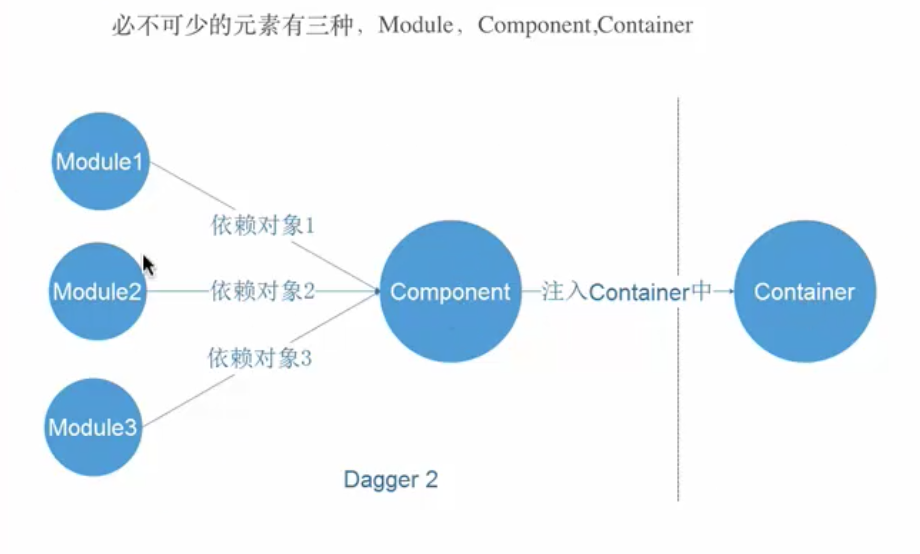

# `练习使用，做些笔记。`

需求：Container需要Module的实例
Comonent 是Container 和Module连接的桥梁

### 讲解下逻辑：



Container需要module1实例，我需要通过Comonent来获取对象，


## Container   
  
```public class MainActivity extends AppCompatActivity {

    @Inject
    ApiService apiService;
    @Override
    protected void onCreate(Bundle savedInstanceState) {
        super.onCreate(savedInstanceState);
        setContentView(R.layout.activity_main);
        DaggerUserComponent.create().inject(this);
        apiService.register();
    }
    }
```
## Comonent

```@Comonent(modules={Module1.class})//e连接Comonent和module
    public interface UserComonent {
    void inject(MainActivity mainActivity); //e连接Container 和Comonent
    }
```
## Module

```@Module
    public class UserModule1 {
    @Provides
    public ApiService provideApiService() {
        return new ApiService();
    }
    }
```
## ApiService

    public class ApiService {
    public void register() {
        Log.d("ApiService", "注册");
    }
    }
## 注意！！

```简单的demo写好了，这里回顾下需要注意的几点，需要对象上加@inject 
然后create（）获取对象inject
Comonent中需要连接Container和Module  ******Comonent是个接口*********
连接Module  @Component(modules = {UserModule1.class})
连接Container时 void inject(Maintivity maintivity)

接下来继续。。。
上面介绍的是new 一个对象 构造方法是无参数的，如果有参数怎么办呢？？？

很简单，首相dagger2会在module寻找这个对象，如果没有，会在该类构造方法中找是否有@inject
来获取对象 如果都没有编译报错

但是如果需要在Contain传进去一个参数呢
需要在Module创建构造方法
然后在Container
DaggerUserComponent
        .builder()
        .userModule1(new UserModule1("www.baidu.com--"))
        .build()
        .inject(this);
这种方式来把这个传进去
```
### 模块化：

```引用Component
@Component(modules = {UserModule1.class},dependencies = {Component})
应用多个Module
@Component(modules = {UserModule1.class,UserModule2.class})
或者Module
@Module(includes = {UserModule2.class})
来实现模块化
```
## 不同的对象 两个不同的对象

```根据@Name 来实现
Container:
@Inject
@Named("dev")
UserManager userManager;
@Inject
@Named("rea")
UserManager userManager1;
Module:
@Named("dev")
@Provides
public UserManager provideUserManagerDev(ApiService apiService) {
    Log.d("UserModule1", "provideUserManager");
    return new UserManager(apiService);
}

@Named("rea")
@Provides
public UserManager provideUserManagerRea(ApiService apiService) {
    Log.d("UserModule1", "provideUserManager");
    return new UserManager(apiService);
}
```

## 单例：

```html
<a herf="www.baidu.com">fe</a>
```


```android studio3.0以上引用
annotationProcessor 'com.google.dagger:dagger-compiler:2.2'
compile 'com.google.dagger:dagger:2.2'
provided 'javax.annotation:jsr250-api:1.0'
```


